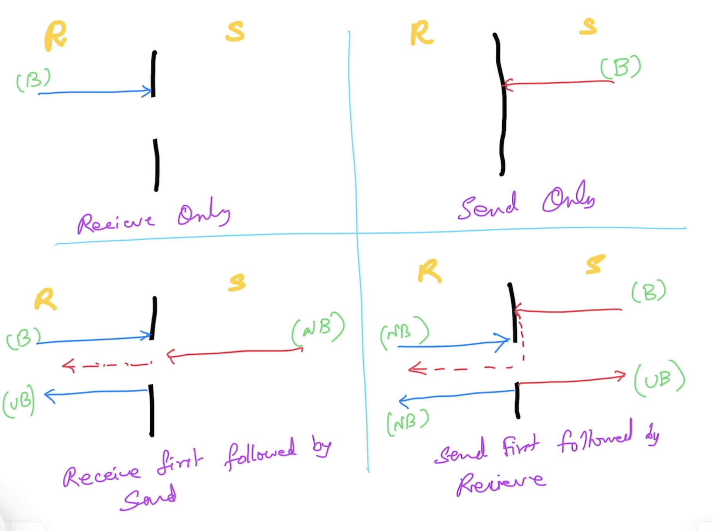

# Advanced Go

## Magesh Kuppan
- tkmagesh77@gmail.com

## Schedule
| What | When |
| ----- | ----- |
| Commence | 9:00 AM |
| Tea Break | 10:30 AM (20 mins) |
| Lunch Break | 12:30 PM (1 hr) |
| Tea Break | 3:00 PM (20 mins) |
| Wind up | 4:30 PM |

## Methodology
- Any Powerpoint
- Discuss & Code

## Repository
- https://github.com/tkmagesh/cisco-advgo-oct-2025

## Software Requirements
- Go Tools (https://go.dev/dl)
- Visual Studio Code (or any editor)
- Docker Desktop (optional)

## Pre-requisites
- Go program structure
- Data Types, Variables, Constants, iota
- if else, switch case, for
- Functions
    - Anonymous functions
    - Variadic functions
    - Deferred functions
    - Higher Order functions
- Structs, Methods, struct composition
- Interfaces
- Errors
- Panic & Recovery

# Day-01
## Concurrency
- Builtin Scheduler
- Concurrent Operations (independent execution paths) are reptresented as "Goroutines"
- Goroutines are cheak (~2KB) compared to OS Threads (~2MB)
- Language Support
    - "go" keyword, "chan" data type, "<-" operator, "range" & "select-case" constructs
- SDK support
    - "sync" package
    - "sync/atomic" packages

### sync.WaitGroup
- Semaphore based counter
- Has the ability to block the execution of a function until the counter becomes 0

### Detecting Data Race
```shell
go run --race <application>

# OR

go build --race <application>

# OR

go test --race <application>
```

### Communication using Channels
- Share memory by communicating

#### Declaration
```go
var <ch_var_name> chan <data_type>
// ex:
var ch chan int
```

#### Initialization
```go
<ch_var_name> = make(chan <data_type>)
// ex:
ch = make(chan int)
```
#### Declaration & Inialization
```go
var ch chan int = make(chan int)
// OR
var ch = make(chan int)
// OR
ch := make(chan int)
```
#### Send Operation 
```go
<ch_var_name> <- <data>
// ex:
ch <- 100
```

#### Receive Operation
```go
<- <ch_var_name>
// ex:
<- ch
```
#### Channel Behaviors


## Context
- Designed for "cancel propagation"
- All context implementations implement "context.Context" interface
- Factory functions
    - `context.Background()` - used for the creation of the 'root' context
    - `context.WithCancel()` - facilitates 'programmatic' cancellation
    - `context.WithTimeout()` & `context.WithDeadline()` - facilitates 'time' based cancellation
    - `context.WithValue()` - used for sharing data across context hierarchies


## Database Programming
### database/sql package
- standard library
- have to write a lot of mundane code
### sqlx
- Open source
- wrapper on `database/sql`
- reduces the mundane code
### sqlc (https://github.com/sqlc-dev/sqlc)
- Open source
- use code generation
### GORM
- Open source
- Object-Relational Mapper